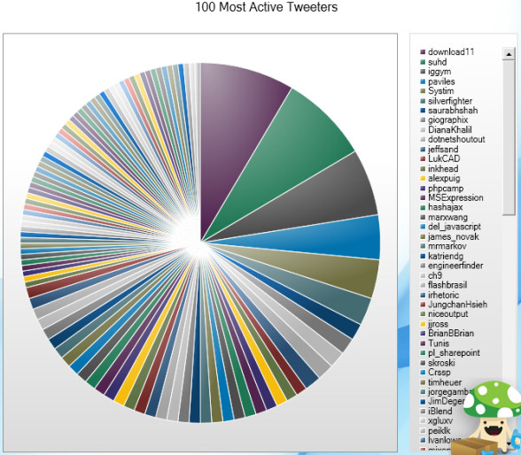
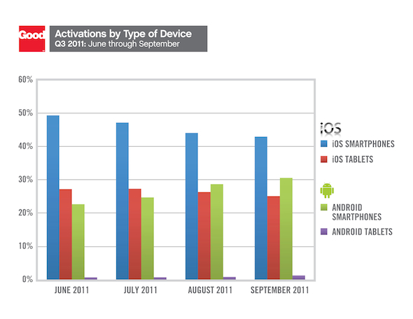

## Bad Data Visualization

This graph shows the national health expenditure amounts in 2003. The
numbers on the graph represent specific spending like (hospital care,
physician, prescriptions drugs, etc) while the percentages are the
percent of the whole spending it empcomess.

The pie chart it does it help illustrate the point the author was
attempting to make. In this graph the author is attempting to show a
comparison of how much more or less the nation spends on health but
since the graph is rotated a weird angle and the chunks look similar in
size its hard to visualize. This visual would have probably been better
in a bar chart format in descending order were we could actually see the
differences in the expenditure amounts. In addition to this the actual
names of the expenditures would also make this graph a lot better as
right now with no key this graph is uninterpretable.

## Good Data Visualization

This article was about how IOS was continue to dominate the US market
going into the summer of 2011. This specific graph shows the activations
by type of devices from the time period of June - September 2011.

This visualization really displays the comparison the author was
attempting to show. The bar plot displays the changes of device
activation over time and this is easy to see due to the stylical choice.
The different brands/types of devices are in different colors which
makes the comparisons east and the graph displays a key which leads to
no confusion. A worse data visualization creator may have used a pie
chart to display this data because these are percentages of a whole but
the changes over time are are a lot easier to see this way.
